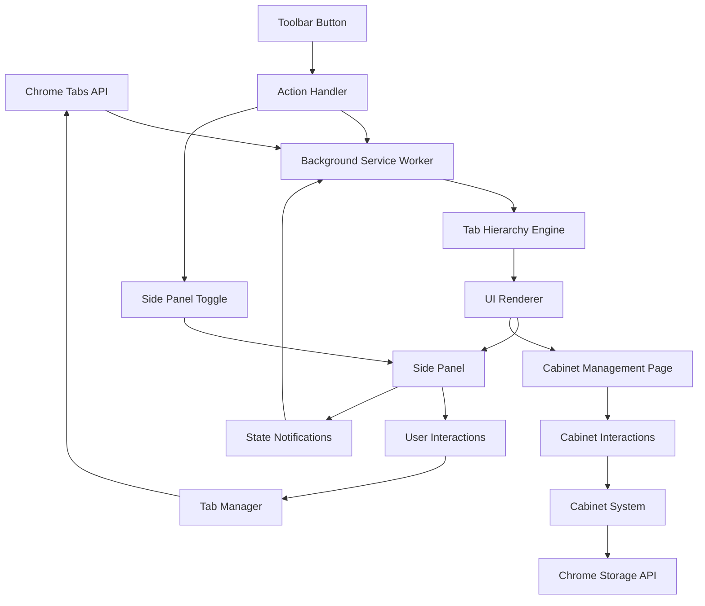

# Design Document

## Overview

The Tab Hierarchy Visualizer (The Cabinet) is a Chrome extension that displays browser tabs in a hierarchical tree structure within the current window. The extension provides visual representation of parent-child relationships between tabs, allows direct tab management through the interface, and enables saving/restoring tab hierarchies as named "Cabinets" for later use.

The extension utilizes Chrome's Manifest V3 architecture with a side panel interface for tab hierarchy visualization and a separate dedicated page for Cabinet management. The UI is styled using Tailwind CSS for consistent, responsive design.

## Architecture

### Extension Structure
```
├── manifest.json          # Extension configuration and permissions
├── background.js          # Service worker for tab event handling and toolbar actions
├── sidepanel.html/js      # Primary interface for tab hierarchy visualization
├── cabinets.html/js       # Dedicated Cabinet management page
├── tests/                 # All test files organized separately
│   ├── unit/             # Unit test files
│   ├── integration/      # Integration test files
│   └── e2e/              # End-to-end test files
└── (uses chrome.storage)  # Browser storage API for saved Cabinets
```

### Core Components

1. **Tab Hierarchy Engine**: Tracks tab relationships and builds tree structure
2. **UI Renderer**: Displays hierarchical tree with visual indicators in side panel
3. **Tab Manager**: Handles tab operations (switch, close, reorder)
4. **Cabinet System**: Saves/restores tab hierarchies directly to Chrome storage
5. **Cabinet Management UI**: Dedicated page for managing saved Cabinets
6. **Event Handler**: Responds to tab changes and user interactions
7. **Toolbar Action Handler**: Manages side panel toggle functionality and state tracking

### Data Flow



### Terminology Clarification

- **Cabinet**: A named collection of tabs with their hierarchical relationships that can be saved and restored later
- **Tab Hierarchy**: The tree structure showing parent-child relationships between tabs in the current window (displayed in side panel)
- **Cabinet Management Page**: Dedicated full-screen interface for managing saved Cabinets (opened in new tab)
- **Side Panel**: Primary interface showing current window's tab hierarchy with quick access to Cabinet management
- **Chrome Storage API**: Browser's built-in storage mechanism (`chrome.storage.local`) used directly by Cabinet System

## Components and Interfaces

### Tab Hierarchy Engine

**Purpose**: Builds and maintains the hierarchical relationship between tabs

**Parent-Child Relationship Logic**:
- **Primary: Opener Tab ID**: Chrome automatically populates `openerTabId` when:
  - User clicks links to open in new tab (Ctrl+click, middle-click, context menu)
  - JavaScript calls `window.open()` from a webpage
  - Webpage programmatically creates new tabs
- **Secondary: Tab Creation Order**: When `openerTabId` is null (manual new tab, bookmarks, direct URL entry), new tab becomes child of currently active tab
- **Manual Grouping**: Users can drag tabs to reorganize parent-child relationships in the UI
- **Fallback Logic**: If no clear parent is identified, new tabs become root-level tabs

**Key Methods**:
- `buildHierarchy(tabs)`: Creates tree structure from tab array using opener relationships and creation order
- `addTab(tab, parentId)`: Adds new tab to hierarchy with specified or inferred parent
- `removeTab(tabId)`: Removes tab and cascades to children (children become orphaned or promoted)
- `updateTab(tabId, changes)`: Updates tab information while preserving relationships
- `getChildren(tabId)`: Returns child tabs for given parent
- `inferParentRelationship(newTab, existingTabs)`: Determines parent based on opener, URL, and timing

**Data Structure**:
```javascript
{
  id: number,
  title: string,
  url: string,
  favicon: string,
  parentId: number | null,
  children: TabNode[],
  level: number,
  isActive: boolean,
  isPinned: boolean
}
```

### UI Renderer

**Purpose**: Renders the hierarchical tree structure with visual indicators and supports incremental updates

**Key Methods**:
- `renderTree(hierarchy)`: Renders complete tree structure (used for initial load and complex changes)
- `renderTabNode(tab, level, isLast)`: Renders individual tab with tree lines
- `updateTabState(tabId, state)`: Updates visual state of specific tab
- `highlightTab(tabId)`: Highlights tab on hover
- `addTabElement(tab, parentId)`: Incrementally adds single tab element to existing tree
- `removeTabElement(tabId)`: Removes specific tab element and handles child reorganization
- `updateTabElement(tab)`: Updates properties of existing tab element without full re-render
- `updateActiveState(tabId)`: Changes only the active state styling of tabs

**Visual Elements**:
- Tree lines (vertical/horizontal connectors)
- Favicons and tab titles
- Active tab highlighting with incremental state updates and enhanced hover states
- Pinned tab indicators
- Loading states
- Tailwind CSS classes for consistent styling and responsive design
- Hierarchy-based padding using Tailwind padding classes (pl-0, pl-4, pl-8, pl-12, pl-16, pl-20)
- Depth level indicators (L0, L1, L2, etc.) displayed as small monospace text with tooltips
- Consistent spacing and typography using Tailwind utility classes
- Progressive color hierarchy: normal (white) → hover (bg-gray-200) → active (bg-blue-200) → active+hover (bg-blue-300)
- Conditional close button visibility: hidden by default, visible on hover or active state with smooth transitions

**Performance Optimizations**:
- Incremental DOM updates for single tab changes
- Targeted element updates instead of full tree re-rendering
- Efficient parent-child relationship management during incremental updates
- Minimal DOM manipulation for state changes

### Tab Manager

**Purpose**: Handles all tab operations and Chrome API interactions

**Key Methods**:
- `switchToTab(tabId)`: Activates specified tab
- `closeTab(tabId)`: Closes tab and children (cascading delete)
- `moveTab(tabId, newIndex)`: Reorders tabs
- `createContextMenu(tabId)`: Shows tab management options

**Chrome API Integration**:
- `chrome.tabs.query()`: Get current window tabs
- `chrome.tabs.update()`: Switch to tab
- `chrome.tabs.remove()`: Close tabs
- `chrome.tabs.move()`: Reorder tabs

### Cabinet System

**Purpose**: Manages saving and restoring of tab hierarchies

**Key Methods**:
- `saveCabinet(name, hierarchy)`: Saves current hierarchy as Cabinet with preserved depth levels
- `loadCabinet(cabinetId)`: Retrieves saved Cabinet
- `restoreCabinet(cabinetId)`: Opens all tabs from Cabinet and recalculates depth levels from parent-child relationships
- `deleteCabinet(cabinetId)`: Removes saved Cabinet
- `listCabinets()`: Returns all saved Cabinets
- `recalculateDepthLevels(tabs)`: Ensures correct level property based on parent-child structure

**Cabinet Data Format** (stored in Chrome Storage):
```javascript
{
  id: string,
  name: string,
  createdAt: Date,
  tabs: TabNode[],
  metadata: {
    tabCount: number,
    windowId: number
  }
}
```

### Cabinet Management UI

**Purpose**: Provides dedicated interface for managing saved Cabinets

**Key Features**:
- Cabinet list display with metadata (name, creation date, tab count)
- Always-visible enhanced Cabinet preview showing detailed tab hierarchy with visual tree structure
- Cabinet operations (save, restore, rename, delete)
- Search and filtering capabilities
- Bulk operations (export, import, cleanup)
- Storage usage monitoring and management

**Always-Visible Cabinet Preview (Compact Design)**:
- **Immediate Display**: Cabinet details are shown automatically without requiring user interaction
- **Space-Efficient Layout**: Compact hierarchical display optimized for viewing many tabs in minimal space
- **Minimal Visual Elements**: Small favicons (12px), simple tree lines, and subtle spacing for maximum information density
- **Domain-Only URLs**: Shows only domain names instead of full URLs to save space while maintaining context
- **Dot Indicators**: Small circular indicators for pinned (blue) and loading (amber) states
- **Subtle Interactions**: Minimal hover effects with left border highlights to maintain clean aesthetic
- **Optimized Scrolling**: Efficient scrolling for large Cabinet previews with minimal visual overhead
- **No Toggle Required**: Eliminates the need for expand/collapse buttons, providing immediate access to Cabinet contents

**Navigation**:
- Accessible from side panel via "Cabinets" button
- Opens in new tab for full-screen Cabinet management
- Breadcrumb navigation back to tab hierarchy

**Key Methods**:
- `renderCabinetList()`: Displays all saved Cabinets with metadata and automatically loads detailed previews
- `renderCabinetPreview(cabinetId)`: Shows compact Cabinet contents with space-efficient hierarchical tab structure
- `renderTabNodeInPreview(tab, level, isLast, ancestorLines)`: Renders individual tab with minimal tree visualization and compact layout
- `handleCabinetRestore(cabinetId)`: Restores Cabinet with confirmation
- `handleCabinetDelete(cabinetId)`: Deletes Cabinet with confirmation
- `handleCabinetRename(cabinetId, newName)`: Renames Cabinet
- `showSaveCabinetDialog()`: Opens dialog to save current hierarchy
- `loadAllCabinetPreviews()`: Automatically loads and displays all Cabinet preview data on page load

### Toolbar Action Handler

**Purpose**: Manages extension toolbar button interactions and side panel state

**Key Features**:
- **Toggle Functionality**: Single click opens/closes side panel
- **Per-Window State Tracking**: Maintains independent state for each browser window
- **State Synchronization**: Coordinates between background script and side panel
- **Graceful Error Handling**: Fallback mechanisms for API failures

**Key Methods**:
- `handleActionClick(tab)`: Processes toolbar button clicks and toggles side panel
- `openSidePanel(windowId)`: Opens side panel for specific window
- `closeSidePanel(windowId)`: Closes side panel using disable/re-enable technique
- `updateSidePanelState(windowId, isOpen)`: Updates internal state tracking
- `handleSidePanelOpened(windowId)`: Processes side panel opened notifications
- `handleSidePanelClosed(windowId)`: Processes side panel closed notifications

**State Management**:
```javascript
// Per-window side panel state tracking
const sidePanelStates = new Map(); // windowId -> boolean (true = open, false = closed)
```

**Communication Flow**:
1. User clicks toolbar button → `chrome.action.onClicked` event
2. Background script checks current state for window
3. If closed: Opens side panel via `chrome.sidePanel.open()`
4. If open: Closes via `chrome.sidePanel.setOptions({ enabled: false })`
5. Side panel notifies background of state changes via messages
6. Background script updates state tracking accordingly

### Event Handler

**Purpose**: Responds to Chrome tab events and user interactions with incremental UI updates

**Event Listeners**:
- `chrome.tabs.onCreated`: Add new tab to hierarchy and send TAB_ADDED message for incremental UI update
- `chrome.tabs.onRemoved`: Remove tab from hierarchy and send TAB_REMOVED message for targeted element removal
- `chrome.tabs.onUpdated`: Update tab information and send TAB_UPDATED message for specific tab refresh
- `chrome.tabs.onActivated`: Update active tab state and send TAB_ACTIVATED message for visual state change only
- `chrome.tabs.onMoved`: Update tab positions and send targeted update messages
- `chrome.action.onClicked`: Handle toolbar button clicks for side panel toggle
- `chrome.windows.onRemoved`: Clean up state when windows are closed

**Incremental Update Messages**:
- `TAB_ADDED`: Notifies side panel to add single tab element without full re-render
- `TAB_REMOVED`: Notifies side panel to remove specific tab element and handle children
- `TAB_UPDATED`: Notifies side panel to refresh specific tab's display properties
- `TAB_ACTIVATED`: Notifies side panel to update only active state styling
- `HIERARCHY_UPDATED`: Fallback message for complex changes requiring full re-render

## Data Models

### TabNode
```javascript
interface TabNode {
  id: number;
  title: string;
  url: string;
  favicon: string;
  parentId: number | null;
  children: TabNode[];
  level: number;
  isActive: boolean;
  isPinned: boolean;
  isLoading: boolean;
}
```

### Cabinet
```javascript
interface Cabinet {
  id: string;
  name: string;
  createdAt: Date;
  updatedAt: Date;
  tabs: TabNode[];
  metadata: {
    tabCount: number;
    windowId: number;
    originalWindowTitle?: string;
  };
}
```

### HierarchyState
```javascript
interface HierarchyState {
  rootTabs: TabNode[];
  tabMap: Map<number, TabNode>;
  activeTabId: number | null;
  windowId: number;
}
```

## Error Handling

### Tab Access Errors
- **Issue**: Restricted tabs (chrome://, extension pages)
- **Solution**: Display with disabled styling, show tooltip explaining restriction
- **Fallback**: Skip restricted tabs in hierarchy operations

### Storage Errors
- **Issue**: Browser storage quota exceeded
- **Solution**: Implement storage cleanup, warn user about limits
- **Fallback**: Temporary in-memory storage with session persistence

### API Permission Errors
- **Issue**: Missing tab permissions
- **Solution**: Request permissions dynamically, show permission prompt
- **Fallback**: Limited functionality mode with available permissions

### Cabinet Restoration Errors
- **Issue**: Saved URLs no longer accessible
- **Solution**: Skip broken URLs, log errors, show restoration summary
- **Fallback**: Restore available tabs, report failed URLs to user

### Toolbar Action Errors
- **Issue**: Side panel API not available or fails
- **Solution**: Graceful degradation with error logging and user notification
- **Fallback**: Attempt basic side panel open without window-specific targeting

### State Synchronization Errors
- **Issue**: Side panel state becomes out of sync with background script
- **Solution**: Implement state reconciliation on side panel open/close events
- **Fallback**: Reset state tracking and allow user to manually toggle

## Testing Strategy

### Test Organization
All test files should be organized in a dedicated `tests/` directory structure to separate test code from production code:

- `tests/unit/` - Unit test files (*.test.ts, *.test.js)
- `tests/integration/` - Integration test files
- `tests/e2e/` - End-to-end test files
- Test files should mirror the source file structure for easy navigation
- Each source file should have a corresponding test file in the appropriate test directory

### Unit Tests
- Tab hierarchy building logic
- Cabinet save/restore operations
- Tree rendering functions
- Event handling methods

### Integration Tests
- Chrome API interactions
- Storage operations
- UI component interactions
- Cross-component data flow
- Toolbar action handler and side panel coordination
- Background script and side panel state synchronization
- Side panel toggle behavior across different Chrome versions

### End-to-End Tests
- Complete tab management workflows
- Cabinet creation and restoration
- Multi-tab scenarios
- Error recovery scenarios
- Toolbar button toggle functionality
- Side panel state persistence across browser sessions
- Multi-window side panel independence

### Performance Tests
- Large tab count handling (100+ tabs)
- Frequent tab change scenarios
- Memory usage monitoring
- Storage operation timing

### Browser Compatibility Tests
- Chrome stable/beta/dev channels
- Different operating systems
- Various screen sizes and resolutions
- Extension update scenarios